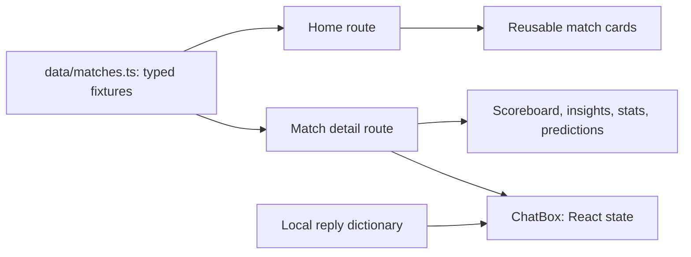

# MatchTalk

A mobile-first soccer companion prototype built with Next.js and TypeScript. MatchTalk explores how a second-screen interface can explain tactics, display match context, and let fans ask questions without leaving the match view.

**Status:** UI prototype. Scores, viewer counts, probabilities, insights, and chat replies are demo fixtures. No sports feed or AI service is connected.

## Implemented interactions

- Home screen with featured, live, and upcoming match cards.
- Dynamic match pages at `/match/[id]`, with a not-found path for unknown IDs.
- Tabbed insights, chat, statistics, and prediction views.
- Question shortcuts and a chat transcript held in React state.
- An “Explain That Play” disclosure and interactive prediction controls.
- Reusable cards, navigation, and scoreboard components styled for mobile and desktop.

## Architecture



The boundary is deliberately small: App Router handles navigation, typed local fixtures supply match context, and client components handle interaction. `components/ChatBox.tsx` selects a predefined response or a fixed fallback; this is not model inference.

## Stack and source guide

Next.js 15 · React 19 · TypeScript · Tailwind CSS 3 · Lucide icons · Manrope font

| Path | Responsibility |
| --- | --- |
| `app/page.tsx` | Match discovery |
| `app/match/[id]/page.tsx` | Detail route and tab state |
| `data/matches.ts` | Match types and demo data |
| `components/ChatBox.tsx` | Local chat interaction |
| `components/PredictionPanel.tsx` | Prediction UI |
| `components/` | Shared presentation components |

## Local development

Install a current Node.js LTS release and pnpm. The committed lockfile is `pnpm-lock.yaml`.

```bash
git clone https://github.com/OmElMon/MatchTalk.git
cd MatchTalk
pnpm install --frozen-lockfile
pnpm dev
```

Open [localhost:3000](http://localhost:3000). The fixture match [Morocco–Spain](http://localhost:3000/match/mar-spa) is a useful starting point. No environment variables or service credentials are required for this prototype.

## Validation and deployment

```bash
pnpm exec tsc --noEmit
pnpm build
# After a successful build:
pnpm start
```

There is no automated test suite or CI workflow in the inspected tree. The existing `lint` script calls `next lint`; its tooling/configuration should be checked before relying on it. This documentation change does not establish a successful build or a production deployment.

Manual checks: open a match, switch each tab, submit a known and unknown question, toggle “Explain That Play,” exercise prediction controls, and visit an invalid match ID. Check keyboard focus and narrow-screen layout.

## Known limits and next steps

- Chat history and prediction state are not persisted.
- Statistics and insight text are shared demo context. Some detail labels and replies specifically reference Morocco–Spain, including on other fixture routes.
- “Live” labels do not imply continuously updated data; displayed viewer counts are illustrative.
- No authentication, database, authorization, provider integration, evaluation pipeline, or rate limiting is implemented.
- An integrated version needs match-specific data contracts, server-side provider access, failure states, and tests for route and context consistency.

No public deployment, benchmark, or real user count is asserted.
